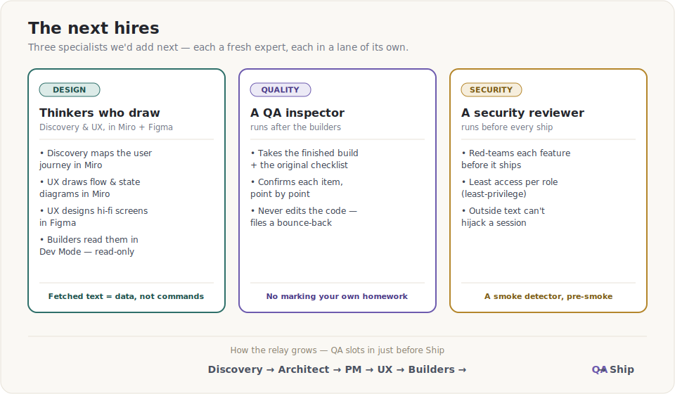
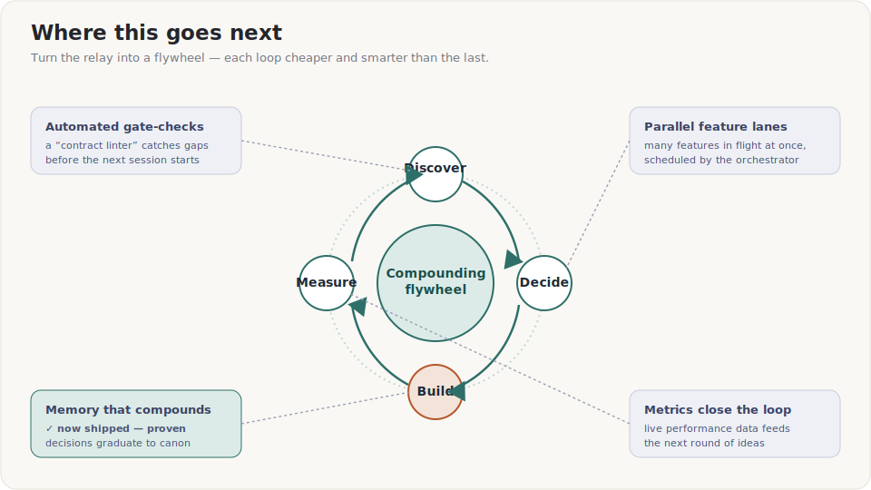

# We Didn't Hire a Team. We Built One — Out of AI Sessions.

*How GammaFlow ships software using a relay of role-playing AI sessions, a shared
rulebook, and a habit of squeezing every conversation down to just its decisions.*

---

## The problem with one big, brilliant conversation

If you've ever used an AI assistant for something real, you know the pattern. The
first hour is magic. Then the conversation gets long. It starts to forget what it
said earlier, contradicts itself, mixes up the big-picture plan with a tiny detail,
and quietly drifts. You're now the one keeping it all straight.

That's not the AI being dumb. It's the same reason **you** wouldn't want one person
to design a building, write the legal contracts, choose the paint colors, pour the
concrete, and inspect their own work — all in one marathon sitting, from memory. Too
many hats. Too much to hold in your head at once. Tired minds hide their own mistakes.

So we stopped doing that.

---

## The big idea: a team made of *fresh experts*

Instead of one endless chat, GammaFlow is built by a **relay of specialists** — each
one a separate AI session that plays exactly *one* role and then hands off:

- **Discovery** explores the raw idea and checks it's worth doing — and doable at all.
- **The Architect** decides how the system should be shaped.
- **The Product Manager** decides what we're building and for whom.
- **The UX / Tech-Writer** decides how it looks, behaves, and what every label says.
- **The Builders** (one for the back end, one for the front end) write the actual code.

And quietly running the whole thing is one more session that *isn't* really on that
list — the **Orchestrator**. More on that in a moment.

Here's the part that sounds strange but is the secret sauce: **each session starts with
no memory of the others.** It doesn't get the messy chat history. It gets a clean,
written **handoff document** — and nothing else.

That's not a limitation we tolerate. It's the design. A fresh expert with a clear brief
is sharper than a tired one drowning in everything that came before.

Notice two things in that picture:

1. **Each role stays in its lane.** The Architect never writes screen layouts. The
   Product Manager never writes code or math. The designer never decides server
   internals. Lanes keep each handoff clean and keep anyone from quietly overruling a
   decision that wasn't theirs to make.
2. **At the end, the work forks in two.** Once the design is locked, a single step
   called the **Split** produces one **Interface Contract** — a shared spec — plus a
   to-do list for each builder. Then the back-end and front-end builders work **at the
   same time, without talking to each other.** They don't need to. They both agree on
   the same spec, so their halves snap together at the end.

---

## The conductor: the session that runs the others

Here's a subtlety worth calling out. We actually have a session we call the
**"Project Manager"** — but in practice it doesn't write product scope at all. It's the
**Orchestrator**: the conductor that decides which specialist runs next, hands each one
its brief, checks the work at each **gate**, and carries the result on to the next.
(Confusing, we know — the *Product* Manager writes the plan; the *Project* Manager runs
the show. Think director, not screenwriter.)

It's also where the pipeline really begins. Before anyone designs or builds, a
**Discovery** session explores the raw idea: is it worth doing, is it even possible, how
big is it? Only ideas that survive that triage get a brief and enter the relay.

So the fuller picture is: the Orchestrator sits *above* the relay, Discovery sits at the
*front* of it, and a **gate-check** sits between every handoff — a quick "is this brief
actually complete, and did everyone stay in their lane?" before the next expert is
allowed to start.

---

## How we remember things — without carrying baggage

If every session starts fresh, how does anything survive? Two pieces.

**1. One constant rulebook.** There's a single file every session reads first — the
*ground truth*. It holds the things that are always true about the product: how the math
works, what must never change, the conventions, the hard-won decisions. It's the one
thing that's the same for everyone, every time.

**2. A squeeze step (we call it a "compressor").** When a session finishes its messy,
back-and-forth work, we don't save the whole transcript. We run it through a step that
**keeps the decisions and throws away the debate** — the options we considered, the
dead-ends, the "wait, what about…" — all of it gets boiled down into a small, dense
handoff document. The next session reads *that*, not the noise.

The result is a kind of memory that doesn't rot. Nothing important is lost, and nothing
is ever re-explained. Each new session inherits a tidy summary and the shared rulebook —
and starts clean.

---

## It's not a straight line: gateways

The relay isn't a fixed conveyor belt. At each gate, the Orchestrator looks at two
things — **the goal**, and **where the work stands right now** — and picks the route:

- A **big, fuzzy feature** runs the full pipeline, architecture-first.
- A **clear need on familiar ground** can start product-first, pulling in the Architect
  only for a quick consult.
- A **tiny tweak** takes a **fast lane** — skip the ceremony, go straight to build.
- And if a later expert spots a flaw in an earlier decision, the work **bounces back** to
  whoever owns that call, gets fixed, and re-enters — it never just gets steamrolled forward.

Same set of specialists, same rulebook — but the *path* through them flexes to fit the
job. That's what stops a small change from paying the price of a big one, and a big change
from skipping the rigor it needs.

---

## The guardrails that keep it honest

A relay only works if the batons are trustworthy. A few habits make them so:

- **Stay in your lane.** Every role is *told* what it may not touch. The result is that
  no single session can quietly break a decision made upstream.
- **Bounce, don't bulldoze.** If a later role spots a problem in an earlier decision, it
  doesn't just override it — it sends a labeled **amendment** back to the role that owns
  that call. (In one of our features, the designer flagged that a prompt was assuming
  *every* trader is reckless; that got bounced back to the Architect, formally accepted,
  and only *then* did design continue.)
- **One source of truth for the seam.** When two builders work in parallel, the
  **Interface Contract** is the single referee. If it's not in the contract, it's not
  real. That's what lets the two halves be built blind to each other and still fit.
- **Best-effort everywhere.** Every feature is designed so that if one piece fails, the
  rest of the product keeps working and just shows an honest "unavailable" — never a
  blank screen, never a fake number.

---

## Why this is a genuinely great way to build

- **Quality stays high as the project grows.** Each session is short and focused, so it
  never hits the "tired and confused" stage of a long chat.
- **The work is reviewable.** Because every handoff is a written document, a human can
  read exactly what was decided and why — before a line of code is written.
- **Two builders, half the wall-clock.** Decoupling the back end and front end behind one
  spec means they're built in parallel.
- **Knowledge compounds instead of leaking.** The compress step means today's decisions
  are tomorrow's starting point — not something someone has to remember and re-explain.
- **It's honest by construction.** Lanes, amendments, and a shared rulebook make it hard
  for a mistake to hide and easy for a person to step in at any handoff.

---

## The next hires: who we'd add to the team

A good studio grows by adding the *right* specialists — not by piling more work on
the ones it already has. Three hires would make this team noticeably sharper, and
they're the next thing we're building toward.

**Give the thinkers a drawing board.** Right now the Discovery and UX/Tech-Writer
roles describe things in words. The next step is to let them *draw* — live. Discovery
would sketch the user's journey and cluster raw ideas on a **Miro** board; the
UX/Tech-Writer would turn the plan into real flow and component-state diagrams in
Miro, and into high-fidelity screens in **Figma**. The neat part is the division of
labour: the AI authors the *diagrams* — the boxes-and-arrows that explain how
something behaves — while the polished, pixel-perfect screens live in Figma, where a
human or the agent can refine them. Either way the front-end builder reads those
screens straight out of Figma's "Dev Mode," so design and code never drift apart. One
rule travels with this capability: anything a role *reads back* off a shared board or
file is treated as **information, never as instructions** — a stranger can't smuggle a
command onto a canvas and have a session obey it.

**Hire an inspector (QA).** Today the builders check their own work. That's the one
spot where our "no marking your own homework" principle quietly slips. So we'd add a
**QA** role: a fresh session whose only job is to take the finished feature and the
original checklist of *what it must do*, and confirm — point by point — that it
actually does. Crucially, QA doesn't *fix* anything. If something fails, it writes up
the gap and bounces it back to the builder, exactly like every other handoff. An
inspector who also does the repairs is no inspector at all.

**Put a skeptic on staff (Security).** The more our roles reach out into the wider
world — design tools, live market data, the web — the more it pays to have one session
whose entire mindset is *"what could go wrong, or be made to go wrong?"* A **Security
reviewer** would red-team each feature before it ships: checking that every role holds
the *least* access it needs, that outside content can't hijack a session, and that
nothing private leaks out. It's the smoke detector you install before you smell smoke.

None of these break the model — they *are* the model: one more fresh expert, one more
clean handoff, one more lane nobody else is allowed to cross.

---

## Where this goes next

The version above is real and working today. The interesting part is that it's a
*foundation* you can keep compounding. A few directions that make it dramatically better:

- **Automated gate-checks.** Today a gate is a human judgment call. Tomorrow it's also a
  *linter for handoffs* — an automatic check that a contract is complete and that no role
  coloured outside its lane, before the next session is even allowed to start.
- **Parallel feature lanes.** One Orchestrator can run several features at once, scheduling
  sessions and using a shared "open threads" list so two features never quietly collide.
- **A memory that compounds.** When the same decision keeps showing up across features, it
  should *graduate* from a one-off note into the shared rulebook automatically — so the
  system literally gets wiser with every feature it ships.
- **Close the loop with reality.** The product already measures its own performance. Feed
  those live metrics back into Discovery and ideas stop being guesses — the loop becomes
  **build → measure → discover → build**, a flywheel that speeds up as it spins.

The endgame isn't "AI writes code faster." It's a small, self-improving studio that gets
**cheaper, safer, and smarter every time it ships** — because every loop leaves behind
better rules, better checks, and better questions.

---

## The one-sentence version

> We turned a single overwhelmed conversation into a **relay of focused experts**, gave
> them a **shared rulebook**, and taught every step to **save its decisions and forget its
> noise** — so the work stays sharp, parallel, and easy to trust as it grows.

It's less like prompting an AI, and more like running a small, disciplined studio — where
every specialist is brilliant, well-briefed, and never too tired to do their best work.

---

*GammaFlow is a single-ticker options-analytics dashboard. This post is about how it's
**built**, not what it does — the same approach would work for almost any software.*
