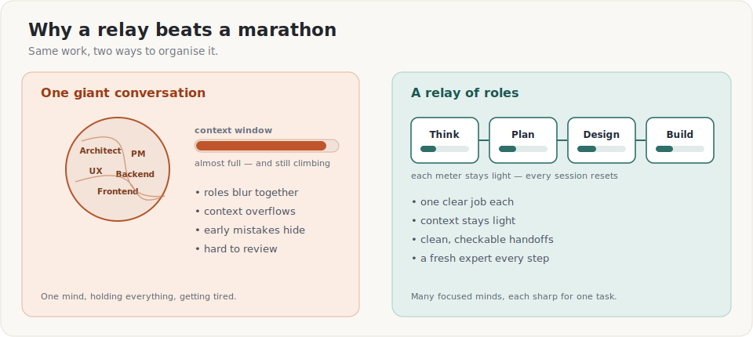
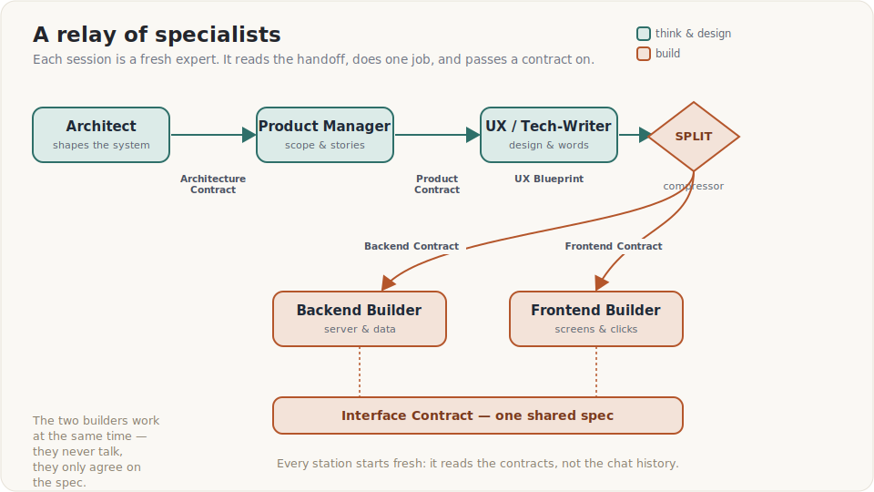
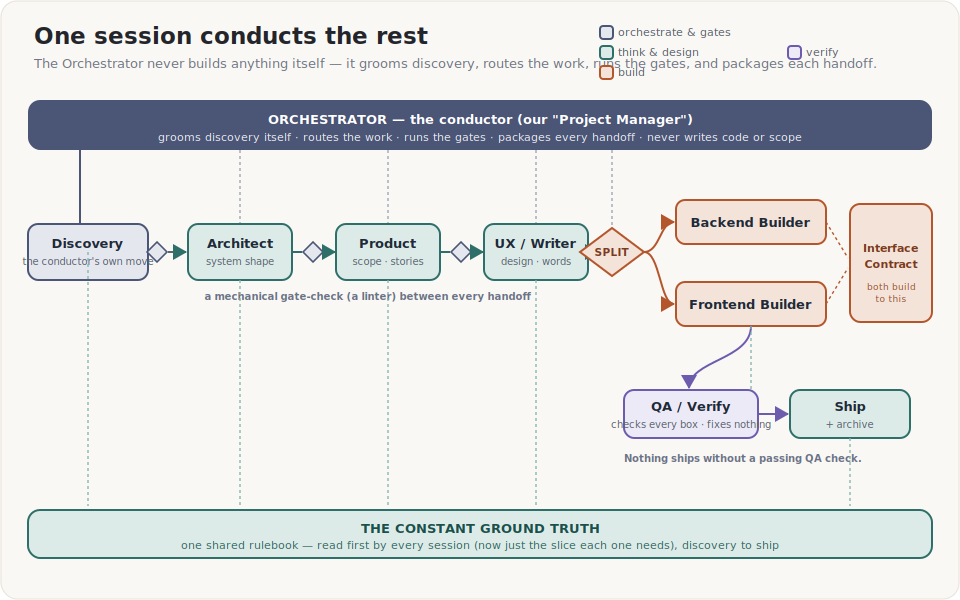
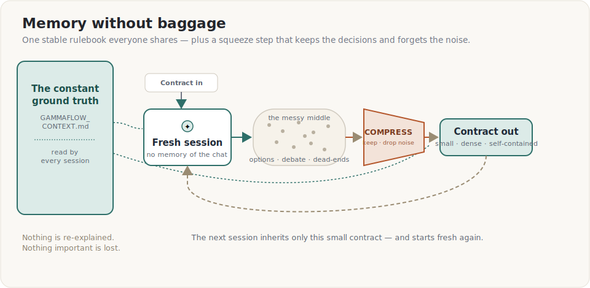
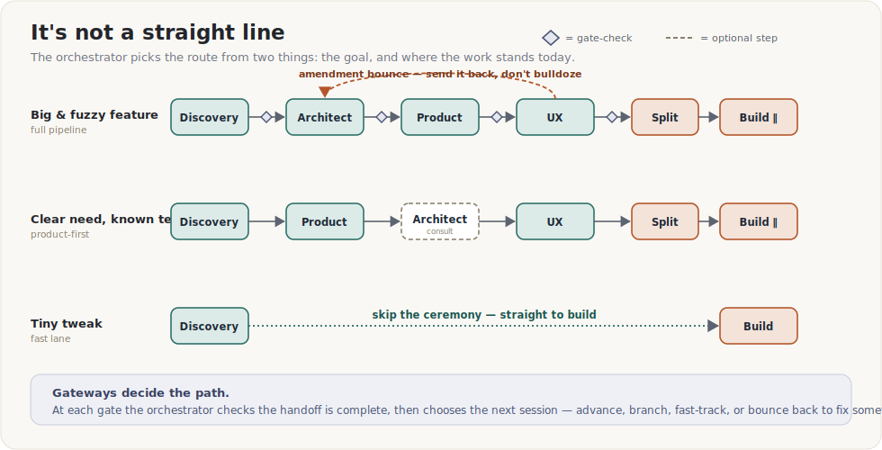
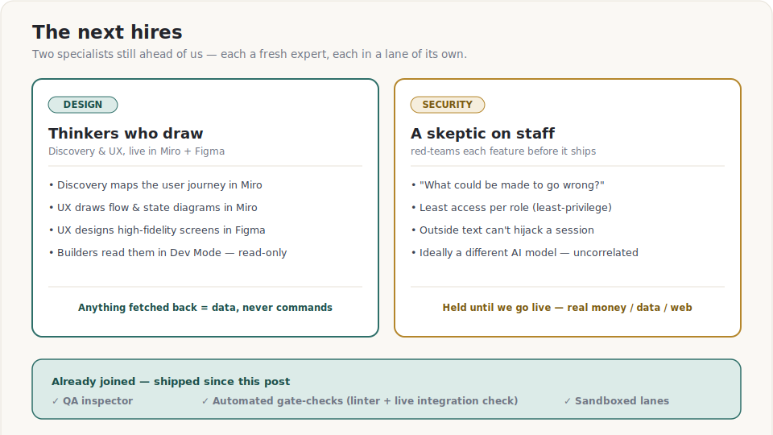
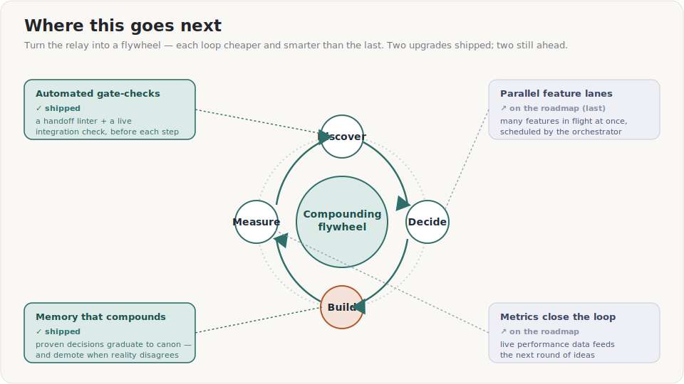

# We Didn't Hire a Team. We Built One — Out of AI Sessions.

*How GammaFlow ships software using a relay of role-playing AI sessions, a shared
rulebook, and a habit of squeezing every conversation down to just its decisions.*

---

## The problem with one big, brilliant conversation

If you've ever used an AI assistant for something real, you know the pattern. The
first hour is magic. Then the conversation gets long. It starts to forget what it
said earlier, contradicts itself, mixes up the big-picture plan with a tiny detail,
and quietly drifts. You're now the one keeping it all straight.

That's not the AI being dumb. It's the same reason **you** wouldn't want one person
to design a building, write the legal contracts, choose the paint colors, pour the
concrete, and inspect their own work — all in one marathon sitting, from memory. Too
many hats. Too much to hold in your head at once. Tired minds hide their own mistakes.

So we stopped doing that.

---

## The big idea: a team made of *fresh experts*

Instead of one endless chat, GammaFlow is built by a **relay of specialists** — each
one a separate AI session that plays exactly *one* role and then hands off:

- **The Architect** decides how the system should be shaped.
- **The Product Manager** decides what we're building and for whom.
- **The UX / Tech-Writer** decides how it looks, behaves, and what every label says.
- **The Builders** (one for the back end, one for the front end) write the actual code.
- **The Inspector (QA)** takes the finished feature and the original checklist and
  confirms, point by point, that it really does what it promised — and is allowed to fail it.

And running the whole thing is one more session that *isn't* really on that list — the
**Orchestrator**. It even does a quick **Discovery** pass up front to decide what's worth
building next. More on both in a moment.

Here's the part that sounds strange but is the secret sauce: **each session starts with
no memory of the others.** It doesn't get the messy chat history. It gets a clean,
written **handoff document** — and nothing else.

That's not a limitation we tolerate. It's the design. A fresh expert with a clear brief
is sharper than a tired one drowning in everything that came before. And we've since made
that fresh start *mechanical*: each role now runs as a **sandboxed worker** with only the
tools its job needs — the Architect literally *cannot* edit or run code, a builder in one
repository literally *cannot* write into the other. The clean brief isn't just good manners
any more; it's a fence.

Notice two things in that picture:

1. **Each role stays in its lane** — and now the lane is enforced by the tools each one is
   handed, not just by asking nicely. The Architect never writes screen layouts. The
   Product Manager never writes code or math. The designer never decides server internals.
   Lanes keep each handoff clean and keep anyone from quietly overruling a decision that
   wasn't theirs to make.
2. **At the end, the work forks in two.** Once the design is locked, a single step called
   the **Split** produces one **Interface Contract** — a shared spec — plus a to-do list for
   each builder. Then the back-end and front-end builders work **at the same time, without
   talking to each other.** They don't need to. They both agree on the same spec, so their
   halves snap together at the end.

---

## The conductor: the session that runs the others

Here's a subtlety worth calling out. We actually have a session we call the
**"Project Manager"** — but in practice it doesn't write product scope at all. It's the
**Orchestrator**: the conductor that decides which specialist runs next, hands each one
its brief, checks the work at each **gate**, and carries the result on to the next.
(Confusing, we know — the *Product* Manager writes the plan; the *Project* Manager runs
the show. Think director, not screenwriter.)

It's also where the pipeline really begins — but with a twist. Unlike every other
specialist, **Discovery isn't a separate hire; it's the conductor's own opening move.**
Before anyone designs or builds, the conductor itself grooms the backlog: gather the
candidate ideas, throw out the ones that don't improve a real decision, score what's left,
and pick exactly *one* to build next. Only that survivor gets a brief and enters the relay.

Why keep this one job in-house when everything else is delegated to a fresh specialist?
Three plain reasons. The raw material Discovery needs — the rulebook, the list of open
questions, the running idea-pool — is exactly what the conductor already has open on its
desk. It happens *before* there's a brief to hand a new hire. And its only output is that
short brief, which the conductor has to carry into the relay anyway. Delegating it would
just mean a new specialist re-reading everything the conductor already read, to produce a
note the conductor then re-reads. So Discovery stays at the conductor's desk — the one
deliberate exception to "every job is a fresh, separate expert."

So the fuller picture is: the Orchestrator sits *above* the relay, Discovery is its own
first move, and a **gate-check** sits between every handoff — a quick "is this brief
actually complete, and did everyone stay in their lane?" before the next expert is allowed
to start. And as we'll see, that gate-check is no longer just a human judgment call.

---

## How we remember things — without carrying baggage

If every session starts fresh, how does anything survive? A few pieces.

**1. One constant rulebook.** There's a single file every session reads first — the
*ground truth*. It holds the things that are always true about the product: how the math
works, what must never change, the conventions, the hard-won decisions. It's the one
thing that's the same for everyone, every time.

**2. A squeeze step (we call it a "compressor").** When a session finishes its messy,
back-and-forth work, we don't save the whole transcript. We run it through a step that
**keeps the decisions and throws away the debate** — the options we considered, the
dead-ends, the "wait, what about…" — all of it gets boiled down into a small, dense
handoff document. The next session reads *that*, not the noise.

The result is a kind of memory that doesn't rot. Nothing important is lost, and nothing
is ever re-explained. Each new session inherits a tidy summary and the shared rulebook —
and starts clean.

**3. A rule that promotes itself.** Every binding decision a session locks gets jotted in a
running ledger. When the same decision has earned its keep across enough features, it
*graduates* on its own — its wording is lifted into the shared rulebook, and from then on
every future session inherits it for free. Nobody has to remember to write it down; sheer
recurrence does the writing. It's the cow-path rule: walk the same shortcut across the grass
enough times, and eventually someone paves it.

**4. …and a rule that *demotes* itself.** A graduated rule is a default, not a cage. The
first time reality contradicts one — the inspector catches it failing, or a later expert
formally overturns it — the rule gets **demoted** right back out of the rulebook, with a note
explaining why. Recurrence promotes; reality can always demote. The memory tracks what's
*true*, not merely what's been *repeated*.

There's one cost lurking in all this: if the rulebook only ever grows, every fresh session
pays to read more of it. So sessions no longer swallow the whole thing. Each one is handed
just the *slice* its brief calls for — plus the short list of rules that must **never** be
skipped, no matter the task. The rulebook stays one file; what each expert actually loads is
a focused excerpt. Knowledge compounds without the reading bill compounding with it.

---

## It's not a straight line: gateways

The relay isn't a fixed conveyor belt. At each gate, the Orchestrator looks at two
things — **the goal**, and **where the work stands right now** — and picks the route:

- A **big, fuzzy feature** runs the full pipeline, architecture-first.
- A **clear need on familiar ground** can start product-first, pulling in the Architect
  only for a quick consult.
- A **tiny tweak** takes a **fast lane** — skip the ceremony, go straight to build.
- And if a later expert spots a flaw in an earlier decision, the work **bounces back** to
  whoever owns that call, gets fixed, and re-enters — it never just gets steamrolled forward.

Same set of specialists, same rulebook — but the *path* through them flexes to fit the
job. That's what stops a small change from paying the price of a big one, and a big change
from skipping the rigor it needs.

---

## The guardrails that keep it honest

A relay only works if the batons are trustworthy. When we first wrote this section, these
were *habits* — things we asked each role to honor. Most of them are now **enforced**, not
just requested:

- **Stay in your lane — now sandboxed.** Every role runs with only the tools its job needs.
  A thinking role can read and write documents but *cannot run or edit code at all*; a builder
  working in one repository *cannot write into the other*. A lane violation isn't something a
  reviewer catches after the fact — it's blocked before it can happen.
- **Every handoff gets a linter.** Before the next expert is allowed to start, an automatic
  check reads the brief: are the required pieces present, did both halves actually bind to the
  shared spec, is a newly-promoted rule properly written into the rulebook? A structural gap
  stops the relay until it's fixed — no waiting for a human to notice.
- **The two halves are *proven* to fit, not assumed to.** The scariest moment in any parallel
  build is the join. So the shared Interface Contract now carries a machine-checkable list of
  exactly what the back end must emit, and a tool runs the *live* server against it. "It
  integrates" stopped being a hope and became a check that has to pass — run by the builder
  before it dares claim done, and again by the inspector before ship.
- **An inspector signs off before anything ships.** A fresh session — pointedly *not* one of
  the builders — takes the finished feature and the original checklist and confirms, item by
  item, that it does what it promised against the actually-running software. It fixes *nothing*:
  a failure bounces back to the builder like any other amendment, and the inspector re-checks
  the fix. Nothing reaches "shipped" without its sign-off. (This was the very first name on our
  "next hires" wish-list. It's on staff now.)
- **Bounce, don't bulldoze.** If a later role spots a problem in an earlier decision, it
  doesn't just override it — it sends a labeled **amendment** back to the role that owns that
  call. (In one of our features, the designer flagged that a prompt was assuming *every* trader
  is reckless; that got bounced back to the Architect, formally accepted, and only *then* did
  design continue.)
- **Best-effort everywhere.** Every feature is designed so that if one piece fails, the rest
  of the product keeps working and just shows an honest "unavailable" — never a blank screen,
  never a fake number.

---

## Why this is a genuinely great way to build

- **Quality stays high as the project grows.** Each session is short and focused, so it
  never hits the "tired and confused" stage of a long chat.
- **The work is reviewable.** Because every handoff is a written document, a human can
  read exactly what was decided and why — before a line of code is written.
- **Two builders, half the wall-clock.** Decoupling the back end and front end behind one
  spec means they're built in parallel.
- **Knowledge compounds instead of leaking.** The compress step means today's decisions
  are tomorrow's starting point — not something someone has to remember and re-explain.
- **It's honest by construction — and increasingly self-checking.** Lanes, amendments, a
  shared rulebook, a linter, a live integration check, and an inspector make it hard for a
  mistake to hide and easy for a person to step in at any handoff.

---

## The next hires: who we'd add to the team

A good studio grows by adding the *right* specialists — not by piling more work on the
ones it already has. Since the first draft of this post we've already made a couple of those
hires: the **QA inspector** above, plus the whole sandbox-and-linter apparatus that now
*enforces* the lanes instead of merely requesting them. Two specialists are still ahead of us.

**Give the thinkers a drawing board.** Right now the Discovery and UX/Tech-Writer roles
describe things in words. The next step is to let them *draw* — live. Discovery would sketch
the user's journey and cluster raw ideas on a **Miro** board; the UX/Tech-Writer would turn
the plan into real flow and component-state diagrams in Miro, and into high-fidelity screens
in **Figma**. The neat part is the division of labour: the AI authors the *diagrams* — the
boxes-and-arrows that explain how something behaves — while the polished, pixel-perfect screens
live in Figma, where a human or the agent can refine them. Either way the front-end builder
reads those screens straight out of Figma's "Dev Mode," so design and code never drift apart.
One rule travels with this capability: anything a role *reads back* off a shared board or file
is treated as **information, never as instructions** — a stranger can't smuggle a command onto
a canvas and have a session obey it.

**Put a skeptic on staff (Security).** The more our roles reach out into the wider world —
design tools, live market data, the web — the more it pays to have one session whose entire
mindset is *"what could go wrong, or be made to go wrong?"* A **Security reviewer** would
red-team each feature before it ships: checking that every role holds the *least* access it
needs, that outside content can't hijack a session, and that nothing private leaks out. We're
deliberately holding this hire until the product goes live — handles real money, real data, or
the open web — because before then, a dedicated red-teamer (ideally on a *different* AI model,
so its blind spots don't match the builders') costs more than it would catch. We know exactly
when to make the hire: the day any of those three things enters the picture.

None of these break the model — they *are* the model: one more fresh expert, one more clean
handoff, one more lane nobody else is allowed to cross.

---

## Where this goes next

The version above is real and working today. The interesting part is that it's a
*foundation* you can keep compounding — and two of the upgrades we once dreamed about have
already crossed from wish-list to working:

- **Automated gate-checks — ✓ now shipped.** A gate used to be a pure human judgment call.
  Now it's also a *linter for handoffs* plus a live integration check — automatic proof that a
  contract is complete, that no role coloured outside its lane, and that the two halves actually
  fit, before the next session is even allowed to start.
- **A memory that compounds — ✓ now shipped.** When the same decision keeps showing up across
  features it *graduates* into the shared rulebook automatically — and, just as importantly, gets
  *demoted* the moment reality contradicts it. The system literally gets wiser with every feature,
  without calcifying a wrong-but-repeated rule into law.
- **Close the loop with reality.** Still ahead: the product already measures its own performance,
  but those live metrics don't yet flow back into Discovery. Wire them in and ideas stop being
  guesses — the loop becomes **build → measure → discover → build**, a flywheel grounded in what
  actually happened.
- **Parallel feature lanes.** Still ahead, and deliberately last: one Orchestrator running several
  features at once. It's the upgrade that finally removes the human-as-conductor — which is exactly
  why it waits until every guardrail above is proven, so we never trade away our main
  error-correction mechanism for raw speed.

To be clear, the flywheel doesn't *replace* the relay — it **is** the relay, run lap after
lap. Its four stations map straight onto the team you already met: **Discover** is the
conductor grooming the backlog, **Decide** is the Architect / PM / UX thinking, **Build** is
the two builders and the inspector, and **Measure** is the live metrics plus that
self-promoting (and self-demoting) memory. The relay is one lap; the flywheel is what happens
across many — each turn a little smarter than the one before.

The endgame isn't "AI writes code faster." It's a small, self-improving studio that gets
**cheaper, safer, and smarter every time it ships** — because every loop leaves behind
better rules, better checks, and better questions.

---

## The one-sentence version

> We turned a single overwhelmed conversation into a **relay of focused experts**, gave
> them a **shared rulebook**, and taught every step to **save its decisions and forget its
> noise** — so the work stays sharp, parallel, and easy to trust as it grows.

It's less like prompting an AI, and more like running a small, disciplined studio — where
every specialist is brilliant, well-briefed, and never too tired to do their best work.

---

*GammaFlow is a single-ticker options-analytics dashboard. This post is about how it's
**built**, not what it does — the same approach would work for almost any software.*
